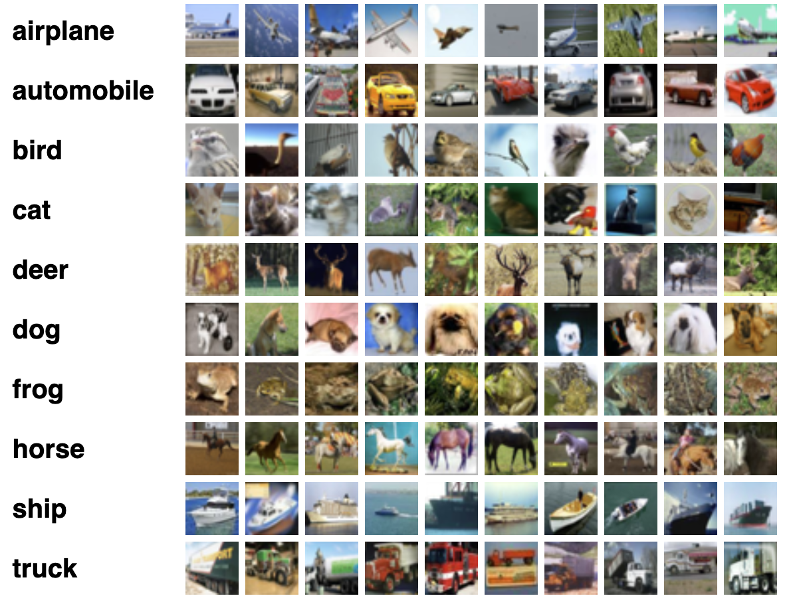
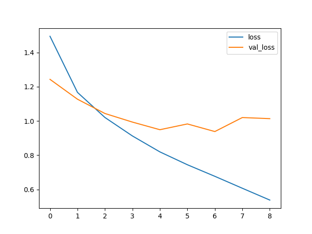
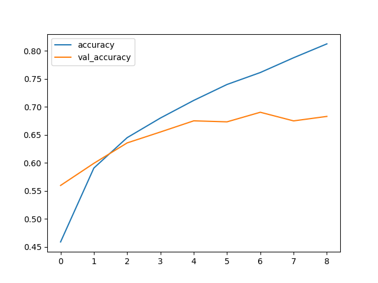

# Cifar Image Model 🤖

> Convolutional neural network that predicts from which category an image belongs.
> The model was trained using Cifar10 dataset.

## Goals

Predict from which category an image belongs:



## Results

### Confusion matrix

```shell
[[734  19  42  25  29  13   8  22  65  43]
 [ 27 803  11  15   5  11   3  13  26  86]
 [ 65   8 516 109 102 112  22  43  17   6]
 [ 22   9  57 507  83 223  30  42  14  13]
 [ 16   3  51  77 655  67  18 101  10   2]
 [ 13   1  51 181  51 629  10  49   8   7]
 [  8   4  70  92  81  59 657  13  10   6]
 [ 19   1  25  49  60  79   5 741   7  14]
 [ 62  30  18  18  14  13   2   6 814  23]
 [ 46  59  13  34   8  10   7  18  32 773]]
```

### Classification report

```shell
              precision    recall  f1-score   support

           0       0.73      0.73      0.73      1000
           1       0.86      0.80      0.83      1000
           2       0.60      0.52      0.56      1000
           3       0.46      0.51      0.48      1000
           4       0.60      0.66      0.63      1000
           5       0.52      0.63      0.57      1000
           6       0.86      0.66      0.75      1000
           7       0.71      0.74      0.72      1000
           8       0.81      0.81      0.81      1000
           9       0.79      0.77      0.78      1000

    accuracy                           0.68     10000
   macro avg       0.69      0.68      0.69     10000
weighted avg       0.69      0.68      0.69     10000
```

## Exploratory data analysis

### Loss



### Accuracy



### Heatmap Confusion Matrix


## Running

To run the model first create a new Python environment and activate it. I'm using [Anaconda](https://www.anaconda.com/) for setting the python version that pipenv should use to set up the environment. The command bellow will automatically setup the environment with conda and pipenv:

```shell
make env
```

Now install all the project dependencies:

```shell
make install-all
```

And run the model:

```shell
make model
```

> [!WARNING]
> Dont run `make model` without deleting `storage/cifar-image-model.keras`, this will
> cause train/test data over fitting.

After running you model, it will be saved inside `storage/cifar-image-model.keras`.
To just run your recent created model and predict a random value from our data set,
use the following script:

```shell
make predict 
```

> [!WARNING]
> In case you have deleted the `storage/cifar-image-model.keras`, remember that to get `make predict` working you need to run `make model` first to create it.

To run TensorBoard with the latest created version of the model within this
repository run:

```shell
make board
```
